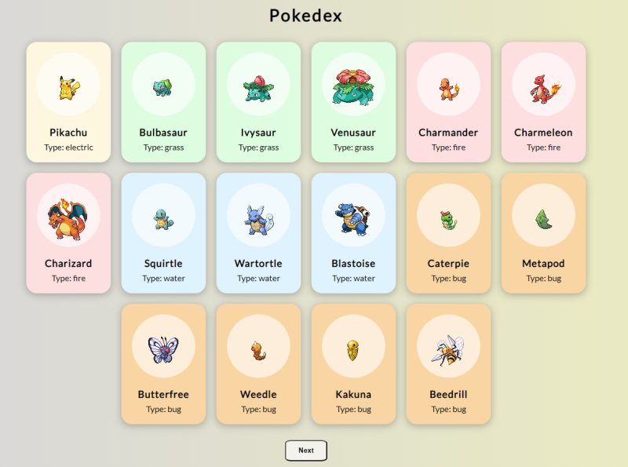

# Pokedex-DOM

[Link to Vercel deployment](https://pokedex-dom.vercel.app/)

Pokedex-DOM is a simple one-page html developped as part of the 
fullstack web development bootcamp in La Capsule (Lyon, 2023). 

Functionality available:
1. The page calls pokeapi.co API containing data for pokemons cards
2. At page load the js fetches data for 15 cards from the API
3. Pressing the 'Next' button fetches other 15 cards
4. The fetch takes place in sequence, starting from card No.1, then going to card No.2 and so on

Skills trained and exercised:
1. Integrate a js file in html to work with the DOM
2. Work with functions definitions and functions calls
3. Fetch data from external API
4. Define event listeners and manage events
5. Modify html page dynamically
